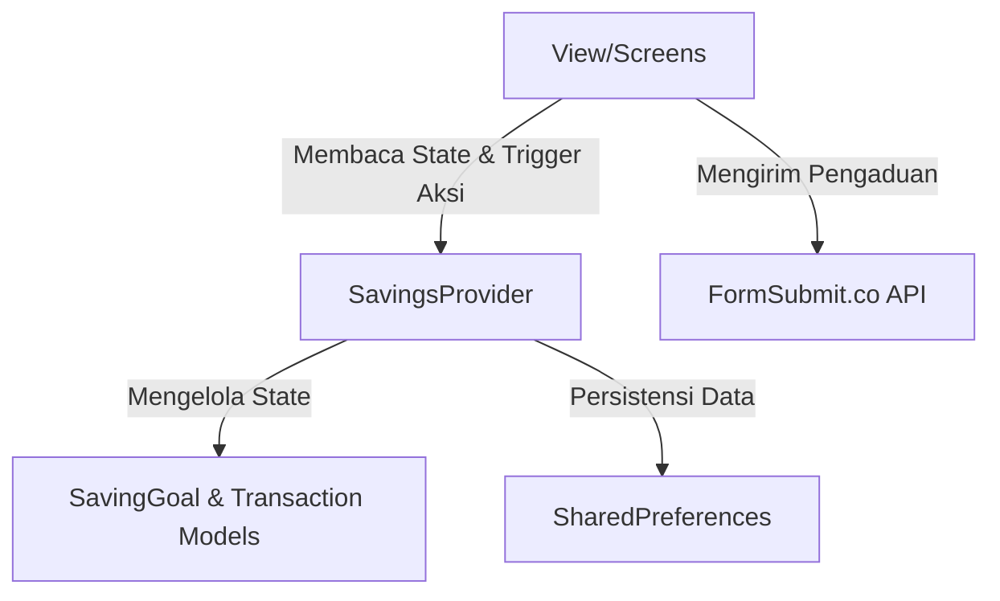

# YokNabung 💰 — Premium Neo-Brutalist Savings Tracker

[](https://flutter.dev)
[](https://dart.dev)
[](https://pub.dev/packages/provider)
[](#)

**YokNabung** adalah aplikasi pencatatan, pelacakan, dan analisis target tabungan (*savings tracker*) berbasis *local-first* yang dibangun menggunakan Flutter. Aplikasi ini dirancang secara khusus dengan gaya desain **Neo-Brutalist** yang berani dan kontemporer—menampilkan kontras warna yang tajam, garis luar hitam tebal (*thick borders*), bayangan solid tanpa blur (*hard shadows*), sudut siku presisi, serta tipografi sans-serif yang tegas.

---

## 🎨 Karakteristik Desain (Neo-Brutalisme)

Seluruh elemen antarmuka (UI/UX) YokNabung mengadopsi bahasa desain Neo-Brutalist modern untuk memberikan pengalaman taktil dan visual yang menonjol:
*   **Warna Latar Premium**: Warm Cream (`#FFFDE7`) untuk kenyamanan membaca dalam waktu lama.
*   **Aksen Kontras**: Menggunakan palet HSL terpilih: Kuning Cerah (`#FFE500`), Hijau Toska (`#00C49A`), Royal Blue (`#4361EE`), dan Jingga-Merah (`#FF5733`).
*   **Garis Batas Solid**: Garis hitam tebal (`#111111` dengan lebar `2.5px`) pada setiap komponen kartu dan tombol.
*   **Taktil Mikro-Animasi**: Tombol interaktif secara dinamis bergeser ke arah bayangan hitam (`translate`) saat ditekan untuk mensimulasikan penekanan fisik yang nyata.

---

## 🚀 Fitur Unggulan

### 1. Pelacak & Detil Target Interaktif
*   **Kategori & Emoji Custom**: Atur target tabungan Anda dengan emoji pilihan dan kategori visual (Pendidikan, Gadget, Liburan, Dana Darurat, dll.).
*   **Foto & Tautan Web Target**: Tambahkan foto barang impian langsung dari Kamera/Galeri serta simpan tautan belanja barang tersebut untuk motivasi tambahan.

### 2. Analitik Perilaku & Adaptasi Kebiasaan Nabung (Savings Analytics)
*   **Kalkulasi Rata-rata Real-Time**: Sistem secara otomatis melacak rata-rata setoran harian Anda berdasarkan riwayat transaksi.
*   **Adaptasi Kebiasaan (Smart Card)**:
    *   **Over-Performing**: Memberikan apresiasi jika setoran harian rata-rata Anda melebihi target alokasi awal.
    *   **Under-Performing**: Memberikan estimasi tanggal pencapaian baru secara realistis berdasarkan kebiasaan nabung Anda yang sebenarnya, lengkap dengan tips penyesuaian.

### 3. Skema Roadmap Pencapaian (Milestones)
*   Membagi setiap target tabungan menjadi 4 fase pencapaian utama (**25%**, **50%**, **75%**, **100%**).
*   Memproyeksikan estimasi tanggal ketercapaian tiap milestone berdasarkan riwayat menabung Anda.

### 4. Pengaduan Layanan Terintegrasi (Feedback System)
*   **Background Dispatch (FormSubmit API)**: Pengaduan, saran, atau laporan kendala dapat dikirim langsung dari dalam aplikasi ke email pengembang tanpa perlu membuka aplikasi email pihak ketiga.
*   **Smart Fallback**: Jika perangkat tidak memiliki koneksi internet, sistem akan otomatis mengarahkan draft pengaduan via email client lokal sebagai cadangan.

### 5. Notifikasi Pengingat Menabung Harian
*   Pengingat harian yang dapat dikonfigurasi pada jam tertentu untuk membangun kebiasaan menabung yang disiplin, ditenagai oleh `flutter_local_notifications`.

---

## 🛠️ Arsitektur Kode (Clean Architecture)

Aplikasi ini dirancang dengan prinsip pemisahan lapisan (separation of concerns) untuk kemudahan pemeliharaan dan pengujian:



### Struktur Folder
```
lib/
├── models/
│   ├── transaction.dart         # Model transaksi (deposit/withdrawal)
│   ├── milestone.dart           # Model fase pencapaian (25% - 100%)
│   └── saving_goal.dart         # Model target tabungan (termasuk Foto & Link)
├── providers/
│   └── savings_provider.dart    # State Management & Logika Matematika Finansial
├── services/
│   └── notification_service.dart # Manajemen notifikasi pengingat lokal
├── widgets/
│   ├── neo_card.dart            # Kontainer Neo-Brutalist kustom
│   ├── neo_button.dart          # Tombol Taktil dengan bayangan offset
│   ├── neo_dialog.dart          # Kumpulan Custom Dialog, Snackbar & Alert
│   ├── roadmap_widget.dart      # Garis waktu proyeksi milestone
│   └── savings_calculator_widget.dart # Panel analitik alokasi harian
├── screens/
│   ├── home_screen.dart         # Dasbor utama & Pengaturan Pengingat
│   ├── goal_detail_screen.dart  # Rincian target, visualisasi grafik & transaksi
│   └── feedback_screen.dart     # Formulir pengaduan & kritik saran
└── main.dart                    # Titik masuk aplikasi & konfigurasi Locale
```

---

## 📦 Paket & Dependensi Utama

| Package | Kegunaan |
| :--- | :--- |
| `provider` | Manajemen state yang reaktif dan terpusat |
| `shared_preferences` | Penyimpanan lokal instan berformat Key-Value |
| `fl_chart` | Pembuat visualisasi grafik batang dan tren garis |
| `image_picker` | Pengambilan gambar target melalui kamera atau galeri |
| `url_launcher` | Pembuka tautan web target dan fallback email |
| `http` | HTTP Client untuk pengiriman feedback ke API |
| `flutter_local_notifications` | Manajemen notifikasi terjadwal lokal |
| `google_fonts` | Integrasi font sans-serif modern |

---

## 🏁 Panduan Memulai Jalankan Proyek

### Prasyarat
Pastikan komputer Anda sudah terpasang **Flutter SDK** versi terbaru (disarankan versi >= 3.19.0).

### Langkah-langkah
1.  **Clone Repositori**
    ```bash
    git clone https://github.com/abday-wong/yoknabung.git
    cd yoknabung
    ```

2.  **Unduh Dependensi**
    ```bash
    flutter pub get
    ```

3.  **Jalankan Unit & Widget Test**
    ```bash
    flutter test
    ```

4.  **Jalankan Aplikasi**
    *   **Android / iOS emulator**:
        ```bash
        flutter run
        ```
    *   **Web Browser**:
        ```bash
        flutter run -d chrome
        ```
    *   **Desktop Windows**:
        ```bash
        flutter run -d windows
        ```

---

## 🔒 Lisensi

Proyek ini dilisensikan di bawah Lisensi MIT. Lihat file [LICENSE](LICENSE) untuk detail lebih lanjut.
